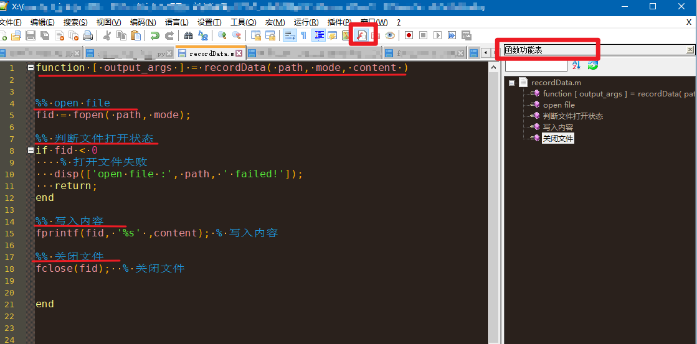

## Add new files 2020/04/13

原来只是更新`functionList.xml`文件，现在新加入了两个文件`shortcuts.xml`和`stylers.xml`，算是我个人的习惯。

文件说明：
- `functionlist.xml`：设置扩展**函数列表功能**
- `shortcuts.xml`：快捷键设置
- `stylers.xml`：各种语言的配色


## functionlist带来的效果

扩展`notepad++`的功能，以便于方便的阅读**matlab代码**。

匹配找到`m文件`中的`function`，以及以`%% `开头的段落行：




## 方法

找到目录`%APPDATA%\notepad++\` 中的`functionList.xml`，加入代码：

```xml
<parser id="matlab_function" displayName="Matlab Node" commentExpr="(%.**$))">
    <function
    mainExpr="(^([ ]|\t)*%%([ ]|\t)+[^\r*\n]+$)|(^([ ]|\t)*function([ ]|\t)+[^\r*\n]+$)"
    displayMode="$functionName">
        <functionName>
            <nameExpr expr="\w+[^;%]*"/>
        </functionName>
    </function>
</parser>

```


## What is Function List

[see the website](https://npp-user-manual.org/docs/function-list/)

Function List Panel is a zone to display all the functions (or  method) found in the current file. The user can use the Function List  Panel to access a function definition quickly by double clicking  function item on the list. Function List can be customized to list the  functions for whichever language. For customizing Function List to  recognize your favorite language, please check below.

Function list contains a search engine (by using regular expression)  and a panel to display the search result (function list). It is designed  to be as generic as possible, and allows user to modify the way to  search, or to add new parser for any programming language. In order to make function list work for your language (if not  supported), you should modify `functionList.xml`. It can be found in `%APPDATA%\notepad++\` or in the Notepad++ installed directory if you use zip package.

